```markdown
# 📋 Employee Weekly Status App  

A Canvas Power App built to simplify how teams share weekly updates — with secure OTP login and real-time visibility through Power BI.

> Built by **Shiva Kapse** — Principal BI Engineer  
[](https://www.linkedin.com/in/shivakapse/)

---

## 🎯 Business Problem  

There wasn’t a consistent way for teams to report weekly progress. Updates were scattered, and managers didn’t have clear visibility into blockers or next steps. This often led to delays and missed follow-ups.

---

## ✅ Solution Built  

To address this, I built a complete end-to-end Canvas Power App that allows employees to:

- 🔐 Log in using OTP-based email authentication  
- 📝 Submit structured weekly status updates  
- 👁️ View and manage their past submissions  
- 👥 Provide managers with a consolidated Team View  
- 📊 Track progress using an embedded Power BI dashboard  
- 📧 Automatically notify managers on every submission  

---

## 🔧 Features  

| Feature | Details |
|---|---|
| 🔐 OTP Login | Secure access for registered employees only |
| 📝 Weekly Status Form | Captures achievements, goals, blockers, and support needs |
| 🚨 Blocker Tracking | Highlights where help is required |
| 📁 My Report Screen | View and manage personal submissions |
| 👥 Team View Screen | Managers can see all team updates |
| ✏️ Edit Record Screen | Update previously submitted entries |
| 📊 Power BI Dashboard | Visual insights on submissions and trends |
| ⚡ Manager Alert Flow | Email notifications on new submissions |
| 🔒 Logout | Clears session securely |

---

## 🛠️ Tech Stack  

  
  
  
  
  

---

## 📐 App Architecture  

```

LOGIN SCREEN
→ Enter Name & Email
→ Send OTP (via Power Automate)
→ Verify & Sign In

↓

WEEKLY STATUS FORM
→ What Achieved
→ Next Week Goals
→ Blockers
→ Support Needed
→ Week Start Date

↓

SharePoint Lists

* P1_EmployeeUsers (Email, OTP, Expiry)
* P1_WeeklyStatus (All submissions)

↓

Power Automate → Notify Manager
Power BI → Dashboard (Submissions, Blockers, Support Needed)

```

---

## 📸 Screenshots  

### 01 — Login Screen  
OTP-based login for secure access  
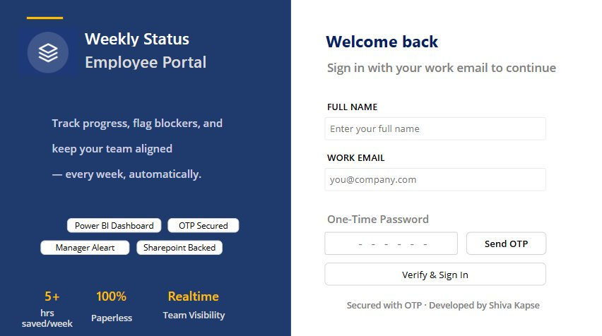

---

### 02 — OTP Email Received  
6-digit OTP sent via Outlook  
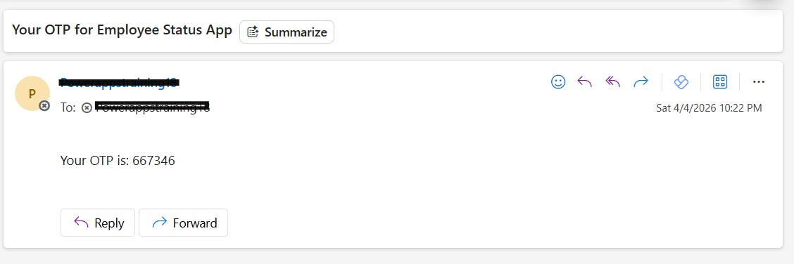

---

### 03 — Weekly Status Form  
Submit weekly updates  
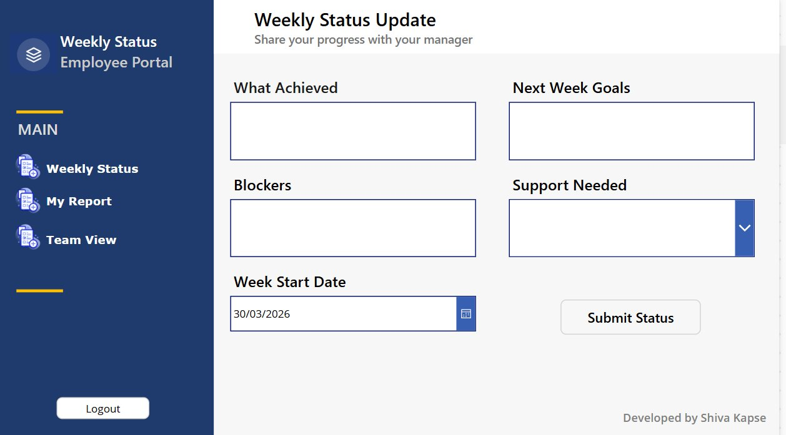

---

### 04 — My Report Screen  
View, edit, or delete submissions  
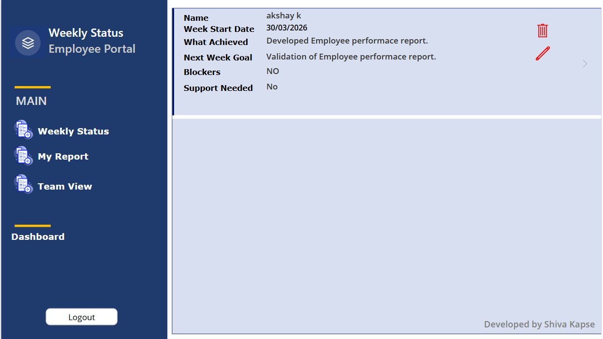

---

### 05 — Team View Screen  
Manager view of all submissions  
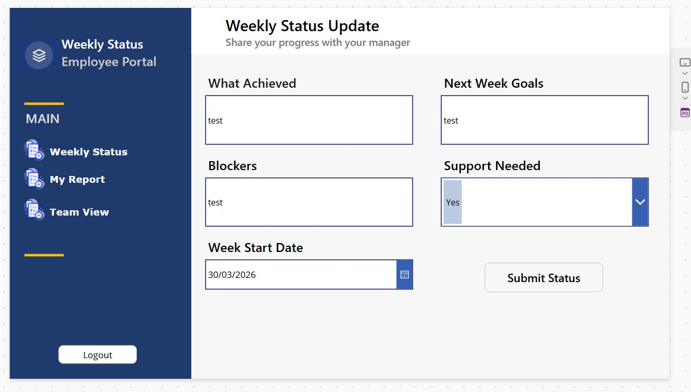

---

### 06 — Edit Record Screen  
Update an existing entry  
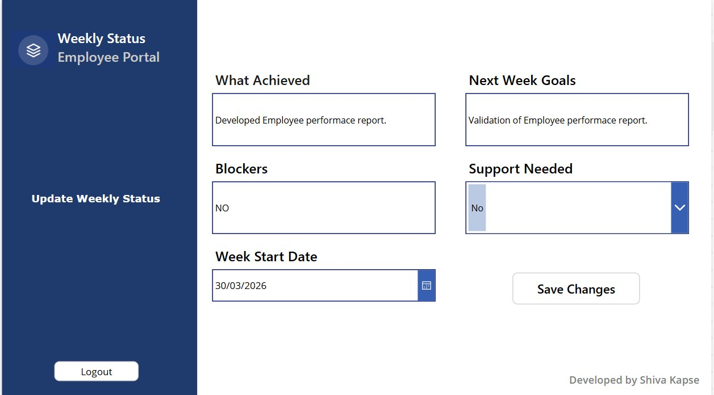

---

### 07 — Power BI Dashboard  
Track trends and insights  
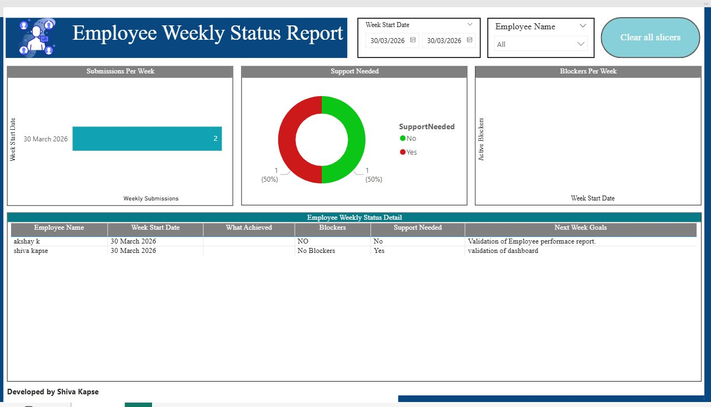

---

### 08 — Manager Email Alert  
Auto email on submission  
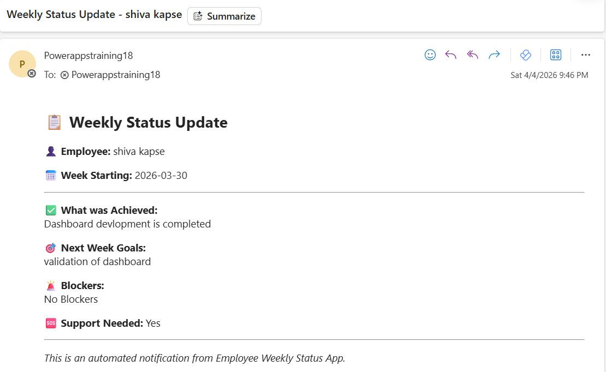

---

### 09 — SharePoint: P1_WeeklyStatus  
Stores all submissions  
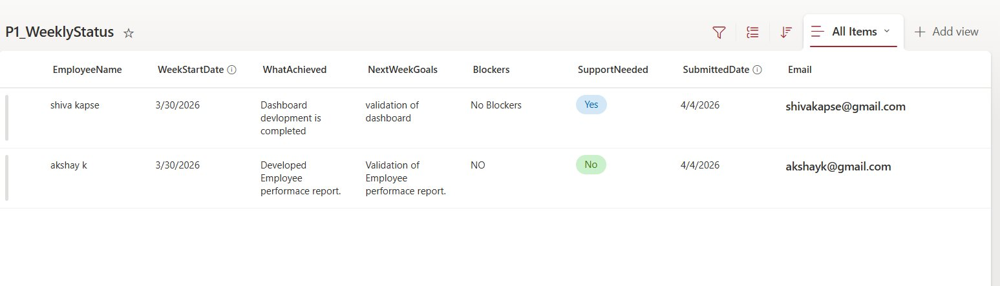

---

### 10 — SharePoint: P1_EmployeeUsers  
Stores registered users  
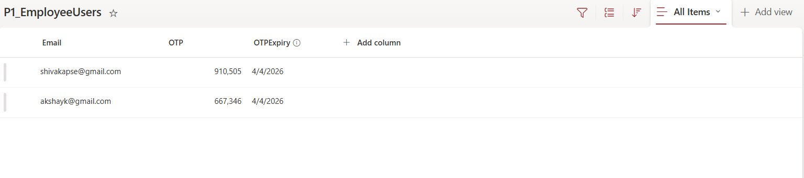

---

### 11 — Power Automate: Notify Manager  
Flow for email alerts  
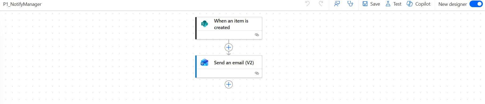

---

### 12 — Power Automate: Send OTP  
Handles OTP generation and email  
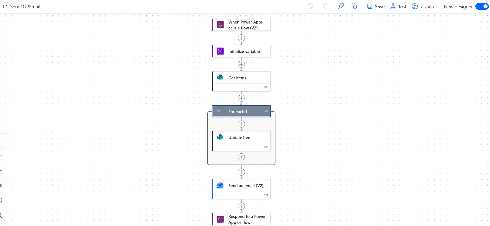

---

## 🗂️ SharePoint Lists  

### P1_EmployeeUsers  

| Column | Type | Description |
|---|---|---|
| Email | Text | Added by Admin |
| OTP | Number | Auto-generated |
| OTPExpiry | DateTime | Valid for 10 minutes |

---

### P1_WeeklyStatus  

| Column | Type | Description |
|---|---|---|
| EmployeeName | Text | From login |
| WeekStartDate | DateTime | Selected by user |
| WhatAchieved | Plain text | Weekly work |
| NextWeekGoals | Plain text | Next steps |
| Blockers | Plain text | Issues |
| SupportNeeded | Choice | Yes / No |
| SubmittedDate | DateTime | Auto |
| Email | Text | From login |

> Note: Keep text fields as Plain text in SharePoint to avoid HTML issues.

---

## 🖥️ App Screens  

| Screen | Purpose |
|---|---|
| LoginScreen | OTP login |
| StatusFormScreen | Submit updates |
| MyReportScreen | View/edit submissions |
| TeamViewScreen | Manager view |
| EditRecordScreen | Edit records |

---

## ⚡ Power Automate Flows  

### P1_SendOTPEmail  

```

Power Apps Trigger
→ Generate OTP
→ Update SharePoint
→ Send Email
→ Return OTP

```

---

### P1_NotifyManager  

```

New SharePoint Item
→ Send Email to Manager

````

---

## 🔑 Key Power Apps Formulas  

### Send OTP  

```powerfx
If(
    IsBlank(txtName.Text),
    Notify("Please enter your full name.", NotificationType.Warning),
    IsBlank(txtEmail.Text),
    Notify("Please enter your work email.", NotificationType.Warning),
    IsBlank(LookUp(P1_EmployeeUsers, Email = txtEmail.Text)),
    Notify("This email is not registered.", NotificationType.Error),
    Set(varEmployeeName, txtName.Text);
    Set(varUserEmail, txtEmail.Text);
    Set(varOTPResult, P1_SendOTPEmail.Run(txtEmail.Text));
    Set(varOTP, varOTPResult.otpvalue);
    Notify("OTP sent to " & txtEmail.Text & ". Please check your inbox.", NotificationType.Success)
)
````

---

### Verify Login

```powerfx
Set(varUser, Last(Sort(Filter(P1_EmployeeUsers, Email = txtEmail.Text), ID, SortOrder.Ascending)));
If(
    IsBlank(varOTP), Notify("Please send OTP first.", NotificationType.Warning),
    IsBlank(txtOTP.Text), Notify("Please enter the OTP.", NotificationType.Warning),
    Value(Trim(txtOTP.Text)) = Value(varOTP),
    Set(varUserEmail, txtEmail.Text);
    Set(varEmployeeName, txtName.Text);
    Reset(txtName); Reset(txtEmail); Reset(txtOTP);
    Set(varOTP, Blank());
    Navigate(StatusFormScreen, ScreenTransition.Fade),
    Notify("Invalid OTP. Please try again.", NotificationType.Error)
)
```

---

### Submit Status

```powerfx
Patch(
    P1_WeeklyStatus,
    Defaults(P1_WeeklyStatus),
    {
        Email: varUserEmail,
        EmployeeName: varEmployeeName,
        WeekStartDate: DataCardValue7.SelectedDate,
        WhatAchieved: DataCardValue9.Text,
        NextWeekGoals: DataCardValue10.Text,
        Blockers: DataCardValue11.Text,
        SupportNeeded: {Value: DataCardValue12.Selected.Value},
        SubmittedDate: Now()
    }
);
NewForm(frmWeeklyStatus);
Notify("Status submitted successfully ✅", NotificationType.Success);
Navigate(MyReportScreen, ScreenTransition.Fade)
```

---

### Logout

```powerfx
Set(varUserEmail, Blank());
Set(varEmployeeName, Blank());
Set(varOTP, Blank());
Navigate(LoginScreen, ScreenTransition.Fade)
```

---

## ⚠️ Known Fixes Applied During Development

| Fix        | Description                  |
| ---------- | ---------------------------- |
| OTP Expiry | Adjusted handling in flow    |
| Form Reset | Used NewForm()               |
| HTML Issue | Changed to plain text fields |
| Dropdown   | Simplified Yes/No            |
| Filtering  | Used logged-in email         |

---

## 🌱 More Apps Coming

* App 2 — In Progress
* App 3 — In Progress

---

*Built using Microsoft Power Platform · SharePoint · Power BI · Outlook*

```
```
